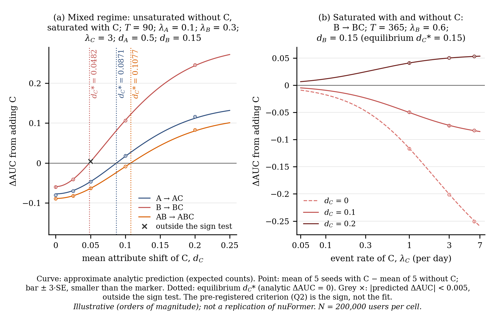
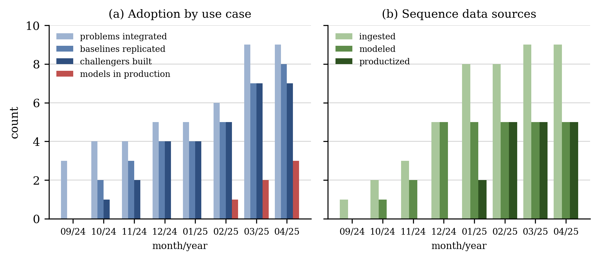
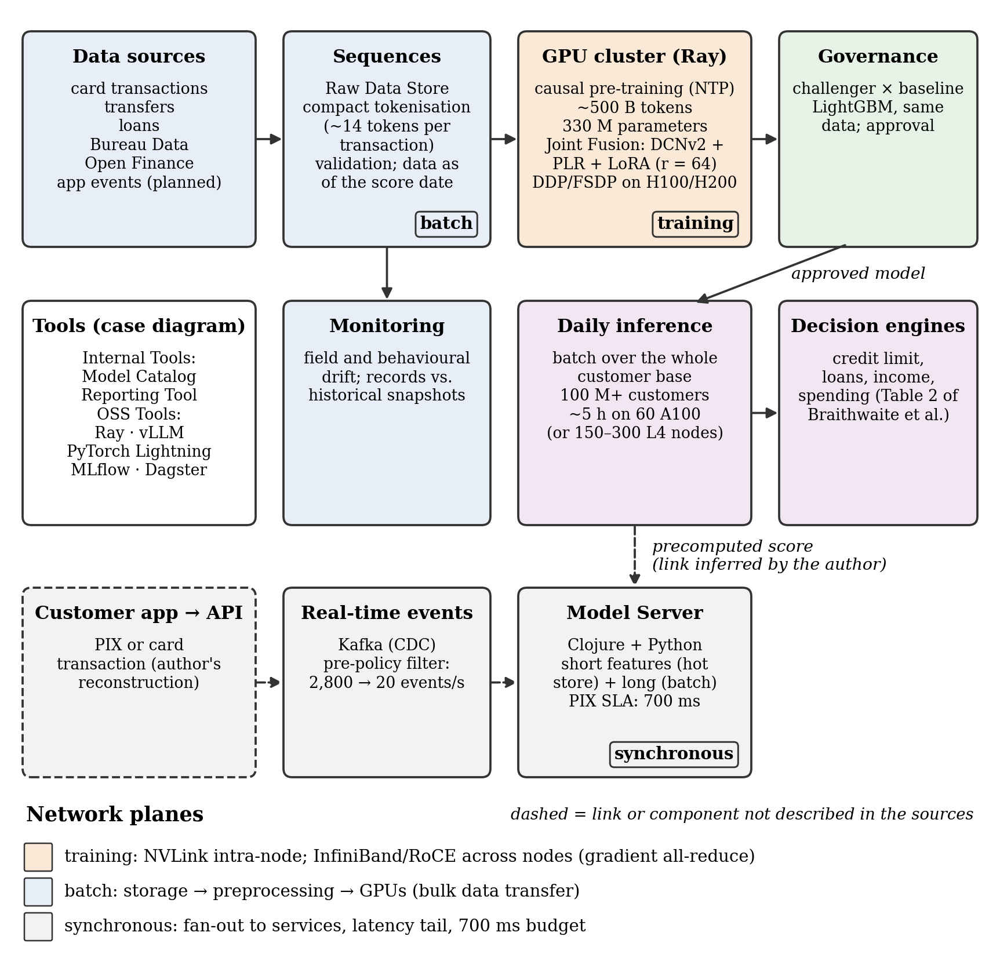

<div align="center">

# Context-Window Occupancy vs. Per-Token Separability

**Under a fluid Gaussian model with an optimal reader (assumptions (i)–(v)), when a fixed token
window is already saturated before a new event source arrives, adding a source whose per-token
separability `ρ_S = d_S²/k_S` is below the occupancy-weighted mean `ρ̄` lowers the ceiling of the
AUC of any reader of that window.**

[](LICENSE)
[](LICENSES/CC-BY-4.0.txt)
[](.github/workflows/ci.yml)
[](tests/test_paper_numbers.py)
[](REPRODUCIBILITY.md)
[](data/prereg/)

`0.1.0` · released 2026-09-28 · [GitHub release](https://github.com/ulissesflores/context-window-occupancy/releases/tag/v0.1.0) · DOI [10.5281/zenodo.23022566](https://doi.org/10.5281/zenodo.23022566)

</div>

> [!IMPORTANT]
> **Finding.** In a pre-registered synthetic replication (720 cells, `N = 200,000` users per cell,
> 5 seeds), the sign of the change in AUC when a source is added followed the closed form in every
> tested comparison: **0 discordant out of 2,011** (149 more fell below the pre-registered minimum
> effect and stayed outside the sign test; 0 ties). A literal token-budget test with heterogeneous
> event cost passed its sign criterion in **8 of 8 cells (40 of 40 seed-level signs, 0 ties)** and
> its level criterion in **16 of 16 combinations** (largest deviation 0.0019 AUC), including a
> mixed-regime pair in which changing only the rate of the new source flips the sign.

This repository is the companion package of a technical case study of **nuFormer**, the transaction
foundation model of Nubank described by Braithwaite et al. (2025,
[arXiv:2507.23267](https://arxiv.org/abs/2507.23267); read in version 2, submitted on 2026-08-10,
[arXiv:2507.23267v2](https://arxiv.org/abs/2507.23267v2)), and of the platform around it. It ships the
closed-form model, the six pre-registered simulations (a displacement replication, a literal
token-budget test and four follow-up families), the order-of-magnitude estimates and the claims
ledger that the case study relies on. The text of the case study is not part of this package.

## What this contributes

1. **A closed form for a fixed token window.** When the window is saturated, its separability is
   `Δ² = K·Σ_s φ_s ρ_s`: the window allocates capacity by occupancy `φ_s = λ_s k_s / Σ_r λ_r k_r`,
   while value comes from per-token separability `ρ_s = d_s²/k_s`. From it and from the general
   fluid formula `h = min(T, K/Σλk)` follow an admission threshold in the saturated regime
   (Corollary 1), a lower threshold `θ·ρ̄` in the mixed regime, with
   `θ = W_R·(T·W′ − K) / (K·λ_S k_S) ∈ [0, 1)`, where `W_R = Σ_R λ_r k_r` is the token arrival rate of
   the current mixture `R` and `W′` the same rate once the new source `S` is added (the mixed-regime
   Observation), monotonicity without saturation even with the new source (Corollary 3),
   tokenization as a channel lever (Corollary 4) and the optimal
   allocation as a continuous knapsack (Corollary 5). There is no new mathematics: the results are
   the mediant inequality, the Neyman–Pearson lemma and Dantzig's ratio rule applied to the
   composition of the input of a transactional foundation model. Statements, proofs and exact scope:
   [`docs/THEORY.md`](docs/THEORY.md).
2. **Six pre-registered simulations of the sign predictions**, each frozen before its code
   ([`data/prereg/`](data/prereg/)): a displacement replication with uniform event cost; a literal
   token-budget test with heterogeneous event cost whose cells each refute a named naive rule; and
   four follow-up families (workflow B) for the limits that test left open and for the two
   corollaries that were analytic only: the exponent of `d`, occupancy against rate weighting,
   event fusion and quotas ([`docs/THEORY.md`](docs/THEORY.md#literal-simulation-checks)).
3. **Order-of-magnitude estimates** of context capacity, batch inference, fine-tuning, pre-training,
   gradient all-reduce, batch throughput and a synchronous-path counterfactual, computed from the
   published figures. Every input is tagged `FACT`, `SPEC` or `ASSUMPTION` with its locator
   ([`configs/estimates_inputs.json`](configs/estimates_inputs.json)), and a claims ledger records
   the numbers and factual statements of the case study with their source, their locator, how they
   were obtained and, where code checked them, which code ([`data/claims-ledger.md`](data/claims-ledger.md)).
   The ledger is not a list of every number in this repository: the worked instances of
   [`docs/THEORY.md`](docs/THEORY.md) are recomputed by its tripwire test, and the published numbers
   are asserted against the sealed outputs by the tests.
4. **A SHA-256 provenance chain** that recomputes from disk and binds environment, code,
   pre-registrations and inputs to the outputs.

## At a glance

| Item | Value |
|---|---|
| Model | Gaussian attribute per event, optimal likelihood-ratio reader, fluid horizon `h = min(T, K/Σλk)`; assumptions (i)–(vi) in [`docs/THEORY.md`](docs/THEORY.md#notation) |
| Displacement replication | 720 cells, every combination of sources `A`, `B`, `C`, 5 seeds, `N = 200,000` users per cell, uniform cost |
| Token KAT | 8 cells (5 saturated, 2 mixed, 1 unsaturated), `R` and `R ∪ S`, 5 seeds, `N = 100,000` users, two event costs |
| Estimates | context capacity, batch inference, fine-tuning, pre-training, all-reduce, batch throughput, synchronous-path counterfactual (`output/estimativas.json`, `output/tables/`) |
| Published numbers | aggregated in [`output/results.json`](output/results.json), each asserted in [`tests/test_paper_numbers.py`](tests/test_paper_numbers.py) |
| Seal | `environment -> code -> prereg -> data -> scores -> figures`, RFC 6962 Merkle trees linked into one root |
| Environment | sealed on CPython 3.14.7 ([`env.json`](env.json), [`requirements.lock`](requirements.lock)); CI on Python 3.12 and 3.14 |

## Quick start

```bash
python3 -m venv .venv && source .venv/bin/activate
python -m pip install -r requirements.lock
python make_provenance.py --verify   # the committed seal recomputes from the files on disk
python run_all.py --smoke            # small N into output/smoke/ -> tests -> seal (what CI runs, ~4 min, 385 tests)
python run_all.py                    # full pre-registered run into output/replicated/, byte-compared (~15 min)
```

Expected tail of each run:

```text
[OK] chain verified: root <sha256> · chain_head <sha256>
...
[OK] tests (…)
[OK] provenance verify (…)
run_all: GREEN
```

`run_all: GREEN` end-to-end, with every `resumo.json` byte-identical to the sealed copy, is measured
only on CPython 3.14.7 with the exact pins in [`requirements.lock`](requirements.lock) (`env.json`
records the sealed environment). Outside that pair, each `resumo.json` records its own Python, numpy
and scipy versions, so a mismatch there reports `DIFF` for that summary and for
[`results.json`](output/results.json) (which hashes the replication summary) instead of `[SAME]`; the
test suite is the judge of correctness in that case — the published numbers are asserted against the
sealed outputs by [`tests/test_paper_numbers.py`](tests/test_paper_numbers.py), independent of the
byte-diff. The two-seal contract, exact run times and an English dictionary of the Portuguese keys
frozen in the outputs are in [`REPRODUCIBILITY.md`](REPRODUCIBILITY.md).

## Results

### Displacement replication (pre-registered falsification criteria)

| Criterion | Result |
|---|---|
| Q1 — with the window saturated and `d_C = 0`, AUC falls strictly as the rate of `C` grows | 248 pairs tested, 0 violations |
| Q2 — sign of the change in AUC when `C` is added (`A -> AC`, `B -> BC`, `AB -> ABC`) | 0 discordant out of 2,011 tested; 149 of the 2,160 comparisons below the minimum effect; 0 ties |
| Q3 — six-sign pattern of Table 4 of Braithwaite et al. (2025) | 410 of 720 cells (closed form: 407); cell-by-cell agreement with the closed form in 717 of 720 |
| Full order of that table | 55 of 720 cells (closed form: 50) |

None of the three criteria fails. Q3 is an existence statement about the model's parameter space,
not a fit to the table. Sources: [`output/replication/resumo.json`](output/replication/resumo.json)
and the pre-registration
[`data/prereg/01-displacement-replication.md`](data/prereg/01-displacement-replication.md).

<p align="center">
  
</p>

**Figure 3.** Panel (a), mixed regime (unsaturated without `C`, saturated with it): the sign of
adding `C` flips at the closed-form break-even of each context, which lies below the Corollary 1
threshold. Panel (b), saturated with and without `C`: the rate of `C` sets the magnitude, never the
sign. Curves are the closed-form prediction with expected counts; points are the means of 5 seeds;
every plotted number is in [`output/figures/fig3_values.json`](output/figures/fig3_values.json).
The break-even values are derived in [`docs/THEORY.md`](docs/THEORY.md#mixed-regime).

### Token KAT (heterogeneous event cost, literal token budget)

| Criterion | Result |
|---|---|
| KT-S — sign of the change in AUC per cell | 8 of 8 cells agree; 40 of 40 seed-level signs; 0 ties; 0 discordant |
| KT-N — AUC level within tolerance of the fluid form | 16 of 16 combinations; 0 exceedances; largest absolute deviation 0.0019 AUC |

Cells: `S1a`, `S1b`, `S2a`, `S2b`, `S3` saturated; `MIX1`, `MIX2` mixed; `N1` unsaturated. The
result that the sealed summary supports, in the wording fixed by the dated deviation
[`data/prereg/04-token-kat-deviations-b.md`](data/prereg/04-token-kat-deviations-b.md): with the
window already saturated before the new source and heterogeneous cost `k_s`, the relevant
separability is `ρ_s = d_s²/k_s`, compared with the occupancy-weighted mean; in the mixed regime the
threshold drops to `θ·ρ̄`; without saturation even with the new source, any source with `d_S > 0`
helps. `MIX1` improves in every seed and `MIX2`, with the same sources and only the rate of `S`
changed, worsens in every seed. Source: [`output/kat_token/resumo.json`](output/kat_token/resumo.json).

### Order-of-magnitude estimates

| Quantity | Value |
|---|---|
| Transactions per context window, compact vs plain-text encoding | ≈146 vs ≈37 (ratio 3.9) |
| Daily batch inference as published: users per A100-second; implied A100 utilization | 92.6; 0.462 (0.24–0.48 on the published range of L4 nodes) |
| Fine-tuning run as published: implied A100 utilization (upper bound: every row fills the window) | 0.364 (LoRA-style, `4N` FLOPs per token) to 0.545 (full, `6N`) |
| Pre-training compute (`C ≈ 6ND`) and H100 GPU-hours at an assumed utilization | 9.9 × 10²⁰ FLOPs; 695.1 GPU-hours |
| BF16 gradient per optimizer step; compute time per step (assumed configuration) | 660 MB; 328 ms |
| Mean throughput of token ids into the GPUs in the daily batch | 0.36 Gb/s |
| Counterfactual of the model on the synchronous payment path | ≈5 ms minimum compute latency (0.7% of the payment SLA); ≈14 A100s at the published fraud-detection rate of 2,800 transactions per second reaching the model before pre-policy filtering, ≈0.1 after (20 per second); at 100% of dense BF16 peak, so a lower bound |

Gradient all-reduce per optimizer step under DDP and FSDP, by link
([`output/tables/enlaces_allreduce.csv`](output/tables/enlaces_allreduce.csv)):

| Link | DDP (ms) | FSDP (ms) | DDP / compute |
|---|---|---|---|
| NVLink 3 (A100, intra-node) | 4.3 | 6.5 | 0.013 |
| NVLink 4 (H100, intra-node) | 2.9 | 4.3 | 0.009 |
| InfiniBand NDR 400 Gb/s | 26.0 | 39.0 | 0.079 |
| Ethernet RoCE 200 Gb/s | 52.0 | 78.0 | 0.158 |
| Ethernet 100 Gb/s | 104.0 | 155.9 | 0.317 |
| Ethernet 25 Gb/s | 415.8 | 623.7 | 1.268 |

Fan-out tail: probability that at least one of `n` independent services exceeds its own p99
([`output/tables/fanout_cauda.csv`](output/tables/fanout_cauda.csv)):

| Services `n` | 1 | 5 | 10 | 20 |
|---|---|---|---|---|
| P(at least one above its p99) | 0.0100 | 0.0490 | 0.0956 | 0.1821 |

### Case-study figures

<p align="center">
  
</p>

**Figure 1** ([`output/figures/fig1_adoption.png`](output/figures/fig1_adoption.png)). Adoption of
the foundation-model platform over its first eight months: (a) use cases (problems integrated,
baselines replicated, challengers built, models in production); (b) sequence-data sources
(ingested, modeled, productized). The counts ([`configs/adoption_counts.csv`](configs/adoption_counts.csv),
asserted by [`tests/test_case_figures.py`](tests/test_case_figures.py)) are redrawn in English from
the two bar charts of Udagawa (2025), *Building foundation models into Nubank's AI platform*,
https://building.nu.com/foundation-models-ai-nubank-transformation/, read from the Wayback Machine
snapshot 20250613214328
(https://web.archive.org/web/20250613214328/https://building.nubank.com/foundation-models-ai-nubank-transformation/).
SHA-256 of the two chart images as captured from that snapshot: adoption,
`18c49a7b4054fc39110d77b73cb29d8133cc719e8833452bb95d1460712f3652`; sequence-data sources,
`3c4c8018fc330f4c48ab74b4b422ede12cf0a5277d492136cd9290416ee00c67` (ledger rows `case-fig-adocao`
and `case-fig-fontes`). The charts themselves are not redistributed ([`NOTICE`](NOTICE)).

<p align="center">
  
</p>

**Figure 2** ([`output/figures/fig2_architecture.png`](output/figures/fig2_architecture.png)). The
author's synthesis of the platform as a flow, with its three network planes named by function:
training (the training fabric), batch (the batch data throughput) and synchronous (the synchronous
path). Quantities in the boxes are inputs of
[`configs/estimates_inputs.json`](configs/estimates_inputs.json), except the LoRA rank, which is the
ledger row `ARX-lora_rank`. Dashed links and the dashed box are not described in the sources: the
precomputed-score link is an inference of the author, the Kafka (CDC) -> Model Server link is a
reconstruction that joins two posts, neither of which connects the two components (ledger row
`INF-caminho-online-recon`), and the customer app -> API entry is the author's reconstruction.
Monitoring (field and behavioural drift, records compared with historical snapshots) and the
training on clusters of H100 or H200 GPUs follow the nuFormer preprint. "Raw Data Store", "Open
Finance", "Bureau Data", "Model Catalog" and "Reporting Tool" appear only in diagrams of the case,
each a ledger row with the capture hash of its diagram; the tools box lists the "Internal Tools"
and "OSS Tools" panels of the case diagram without giving any tool a role, as the diagram does.
Every drawn text has a source entry in [`tests/test_case_figures.py`](tests/test_case_figures.py).
Claim map of every figure: [`scripts/make_figures.py`](scripts/make_figures.py).

### Pre-registered simulation checks (workflow B)

Four further families of literal token-budget simulations address the open limits of the token KAT
and the two corollaries that were analytic only. Each family was frozen before its code, with its
own grid, analytic table and random stream ([`data/prereg/`](data/prereg/), amendments in
[`data/PREREGISTRATION.md`](data/PREREGISTRATION.md)), and each passed its pre-registered verdict.
Under the fixed generator and the oracle reader every checked statement is an algebraic identity of
the model, so a pass reads "checked by literal simulation", never "measured": the families test the
fluid approximation and the literal implementation.

| Family | Result |
|---|---|
| EXP — exponent of d in the per-token separability | 6 of 6 cells agree in sign (30 of 30 seed-level signs, 0 ties, 0 discordant); level of the difference within the frozen tolerance in 6 of 6 |
| OCC — occupancy against rate weighting | 10 of 10 verdict cells agree (50 of 50 seed-level signs, 0 ties, 0 discordant); level within tolerance in 20 of 20 combinations; threshold cells 2 of 2 agree, outside the verdict |
| CMP — event fusion | 28 of 28 signed contrasts agree (140 of 140 seed-level signs, 0 ties, 0 discordant); exact null within its tolerance; level within tolerance in 24 of 24 combinations |
| C5 — quotas against the recency cut | anchors 10 of 10; sign 13 of 13 strict comparisons, 0 ties; size 19 of 19 within the frozen tolerance, 0 without power; level 30 of 30; Consequence sub-test and decay boundary pass |

EXP checks the per-token accounting against the linear and cubic rules of thumb (Corollary 1 with
`ρ_s = d_s²/k_s`); OCC, the occupancy weighting of the mean `ρ̄` in both directions; CMP, event
fusion (Corollary 4(b)); C5, adaptive per-source quotas ordered by `ρ_s` against the recency cut
(Corollary 5). The licensed statements, each with its regime qualifier, the per-cell tables and what
each family cannot establish are in
[`docs/THEORY.md`](docs/THEORY.md#literal-simulation-checks). Sources:
[`output/exponent/resumo.json`](output/exponent/resumo.json),
[`output/occupancy/resumo.json`](output/occupancy/resumo.json),
[`output/fusion/resumo.json`](output/fusion/resumo.json) and
[`output/quotas/resumo.json`](output/quotas/resumo.json), aggregated in
[`output/results.json`](output/results.json).

## What is and isn't claimed

**Claimed.** Under the model and assumptions (i)–(v), the closed forms of
[`docs/THEORY.md`](docs/THEORY.md): Proposition 1, Corollary 1, the mixed-regime Observation and
Corollary 3, each with the proof given there; Corollary 2, Corollary 4 and the Consequence as direct
readings of those closed forms, argued where they are stated, without a separate proof; and
Corollary 5 as an application of Dantzig's ratio rule for the continuous knapsack (Dantzig, 1957),
which the document cites rather than proves. In the pre-registered grids, the literal
simulations follow the sign predictions of those closed forms, with the counts above. The estimates
follow from their stated inputs, each tagged as a fact of a source, a vendor datasheet value or an
assumption of the author. In the sealed environment every output regenerates byte for byte.

**Not claimed.** Nothing about the AUC change of any specific trained model, nuFormer included: the
theory bounds the **ceiling** of any reader of the same observable window, and a learned model
can sit below it. No replication of nuFormer: the simulations are synthetic and illustrative, in
orders of magnitude. The real per-source values of `ρ_s` are not identifiable from public data
(assumption (vi)). The simulations cannot falsify the algebra of the closed forms; they test the
fluid approximation and the implementation, and they measure no exponent, weight, factor or order
of policies. Limits of the token KAT, stated in [`docs/THEORY.md`](docs/THEORY.md#testing-status):
it does not discriminate the exponent of `d` when Corollary 1 is applied without checking the regime
(under the general fluid formula the mixed cell `MIX2` does, a post hoc reading of one cell that was
not pre-registered); the pre-registered EXP family of workflow B then checks it in cells designed
against the linear and the cubic rules, a check of the pipeline, not of the exponent itself. The
occupancy-against-rate comparison, which rested on a single cell (`S3`), is checked by literal
simulation on a pre-registered family of cells in both directions (OCC). Corollary 4(b) (CMP, event
fusion) and Corollary 5 (C5, adaptive per-source quotas) are checked by literal simulation, each
with its regime qualifier ([`docs/THEORY.md`](docs/THEORY.md#literal-simulation-checks)). `θ` is
still located only within a range of rates. The estimates are not measurements of any company's
infrastructure. Follow-up work is listed in [`ROADMAP.md`](ROADMAP.md).

**Frozen.** The inputs transcribed from the sources, the adoption counts read from public charts
and the pre-registrations are frozen evidence: the chain proves they were not altered after sealing,
not that they match their sources; that is what the locators and the capture hashes of the ledger
are for. The claims ledger itself is **outside** the chain: it is regenerated from the author's
working ledger whenever a claim is added or corrected, and its dictionary counts every
transformation ([`data/claims-ledger.md`](data/claims-ledger.md)). The sources themselves are not
redistributed ([`NOTICE`](NOTICE)).

## Integrity

```bash
python3 make_provenance.py --verify         # exit code = number of problems, at most 255 (0 = verified)
sha256sum -c runs/v0.1.0/sha256sums.txt     # no Python needed; macOS: shasum -a 256 -c
python3 code/provenance_chain.py selftest   # the chain tool's own known-answer tests
```

`--verify` prints the root and the chain head, which are also recorded in
[`runs/CHAIN.jsonl`](runs/CHAIN.jsonl); the manifest holds no absolute path. Editing any sealed file
breaks the chain; documentation and metadata are deliberately outside it. What the chain proves and
what it does not (it is not a timestamp) is in [`REPRODUCIBILITY.md`](REPRODUCIBILITY.md).

## Layout

```text
code/                    model, simulations, estimates, figures, vendored provenance tool
scripts/make_figures.py  every figure, with the claim map in its docstring
tests/                   published numbers, locks, workflow-B family suites, theory tripwire,
                         hygiene, stage disjointness
configs/                 estimate inputs (FACT/SPEC/ASSUMPTION + locator), adoption counts, stages.json
data/prereg/             frozen pre-registrations (sanitized copies with an English note), analytic
                         tables
data/                    token-KAT and workflow-B grids, claims ledger and its English dictionary, and
                         PREREGISTRATION.md (index of the pre-registrations and their amendments)
docs/THEORY.md           closed-form model, proofs, exact scope, testing status, workflow-B checks
output/                  sealed outputs, results.json, tables, figures with JSON sidecar
output/replicated/       replication side (full run and, under output/smoke/, CI); never sealed, git-ignored
runs/                    manifest.json + sha256sums.txt per sealed run; CHAIN.jsonl
env.json                 genesis of the chain (the sealed environment)
run_all.py               single entry point: full run | --smoke | --publish
make_provenance.py       build the seal, or --verify it
```

## Author

**Carlos Ulisses Flores** — Codex Hash Research Laboratory

[](https://orcid.org/0000-0002-6034-7765)
[](https://ulissesflores.com)
[](http://lattes.cnpq.br/6905246706890561)

## Citation

Version 0.1.0 was released on 2026-09-28 and is archived on Zenodo. Cite the concept (all-versions)
DOI [10.5281/zenodo.23022566](https://doi.org/10.5281/zenodo.23022566), which always resolves to the latest version; the DOI of
version 0.1.0 itself is [10.5281/zenodo.23022567](https://doi.org/10.5281/zenodo.23022567).

```bibtex
@software{flores2026contextwindow,
  author  = {Flores, Carlos Ulisses},
  title   = {Context-Window Occupancy vs. Per-Token Separability: companion code,
             simulations and estimates},
  year    = {2026},
  version = {0.1.0},
  doi     = {10.5281/zenodo.23022566},
  url     = {https://github.com/ulissesflores/context-window-occupancy},
  note    = {Codex Hash Research Laboratory. Release v0.1.0, archived on Zenodo},
}
```

Machine-readable metadata: [`CITATION.cff`](CITATION.cff) · [`codemeta.json`](codemeta.json) ·
[`.zenodo.json`](.zenodo.json).

## License

- **Code** (`code/`, `scripts/`, `tests/`, `run_all.py`, `make_provenance.py`):
  [Apache-2.0](LICENSE).
- **Text, figures and data** authored here: [CC BY 4.0](LICENSES/CC-BY-4.0.txt).
- Third-party sources are not redistributed; see [`NOTICE`](NOTICE).

## Figures of the paper ↔ files in this repository

All figures are generated in English by [`scripts/make_figures.py`](scripts/make_figures.py)
(`fig1`, `fig2`) and [`code/figure3.py`](code/figure3.py) (`fig3`); each is re-derived by
`run_all.py` and checked byte-identical to the sealed copy under `output/figures/`.

| Figure | File | Generated by | Source numbers | Asserted by |
|---|---|---|---|---|
| 1 — Adoption | `output/figures/fig1_adoption.png` | `scripts/make_figures.py` (calls `code/case_figures.py`) | `configs/adoption_counts.csv` | `tests/test_case_figures.py` |
| 2 — Architecture | `output/figures/fig2_architecture.png` | `scripts/make_figures.py` (calls `code/case_figures.py`) | `configs/estimates_inputs.json`, claims ledger | `tests/test_case_figures.py` |
| 3 — Replication | `output/figures/fig3_replication.png`, `fig3_values.json` | `code/figure3.py` | `output/figures/fig3_values.json` | `tests/test_figure3.py` |

The claim map at the top of `scripts/make_figures.py` states, per figure, what each drawn element
supports and which ledger row or input backs it. This repository ships only the English-language
PNGs; it makes no claim about any other rendering of the same data.


## Anchor references

- Braithwaite, D. T., et al. (2025). *Your spending needs attention: Modeling financial habits with
  transformers* (arXiv:2507.23267). https://doi.org/10.48550/arXiv.2507.23267 — read in version 2,
  submitted on 2026-08-10 (arXiv:2507.23267v2); page, section and table numbers refer to it.
- Neyman, J., & Pearson, E. S. (1933). IX. On the problem of the most efficient tests of statistical
  hypotheses. *Philosophical Transactions of the Royal Society of London. Series A, Containing Papers
  of a Mathematical or Physical Character, 231*(694–706), 289–337.
  https://doi.org/10.1098/rsta.1933.0009
- Dantzig, G. B. (1957). Discrete-variable extremum problems. *Operations Research, 5*(2), 266–288.
  https://doi.org/10.1287/opre.5.2.266
- Vaswani, A., et al. (2017). Attention is all you need. *Advances in Neural Information Processing
  Systems, 30*.
  https://proceedings.neurips.cc/paper_files/paper/2017/hash/3f5ee243547dee91fbd053c1c4a845aa-Abstract.html
- Kaul, S., Yates, R., & Gruteser, M. (2012). Real-time status: How often should one update?
  *2012 Proceedings IEEE INFOCOM*, 2731–2735. https://doi.org/10.1109/INFCOM.2012.6195689
